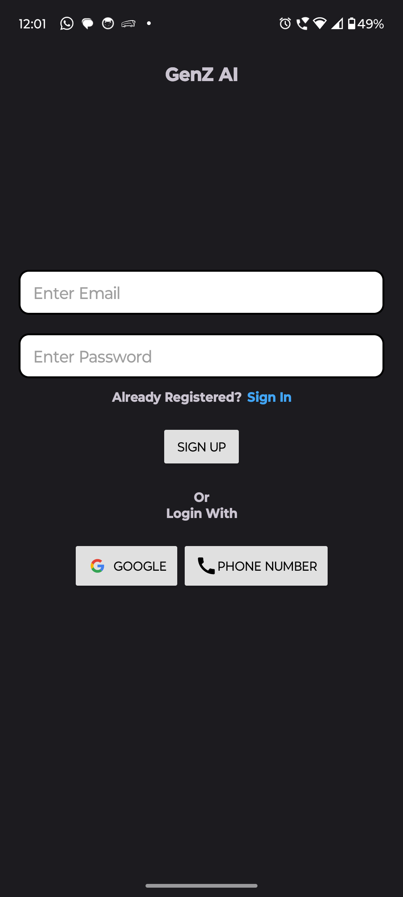
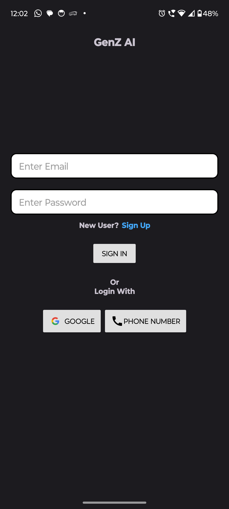
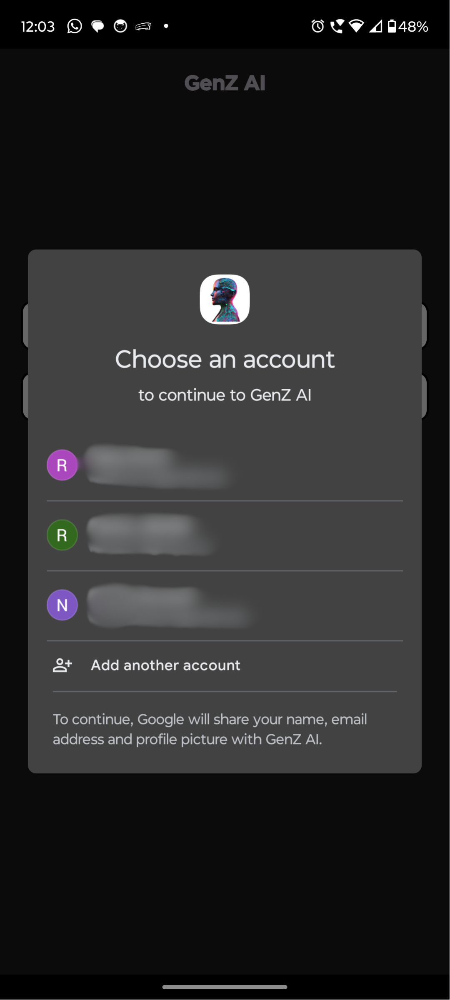
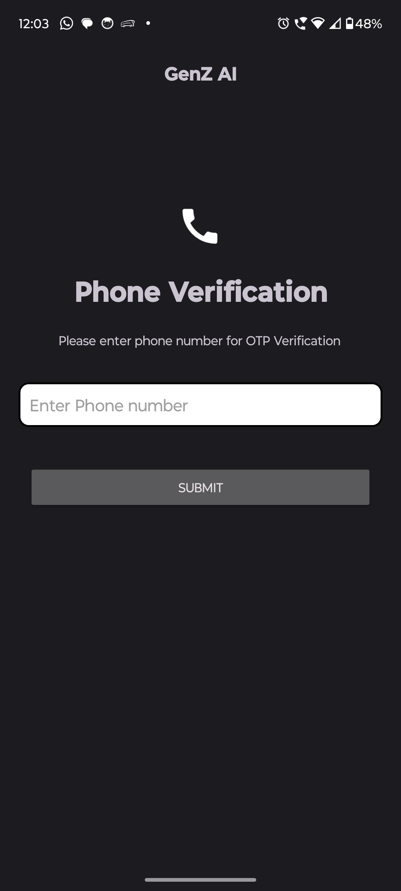
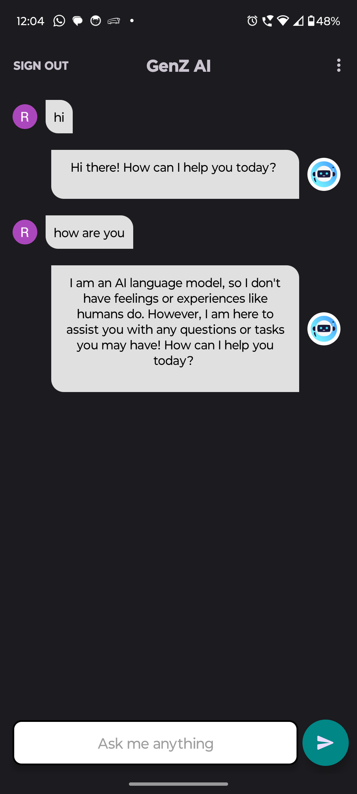
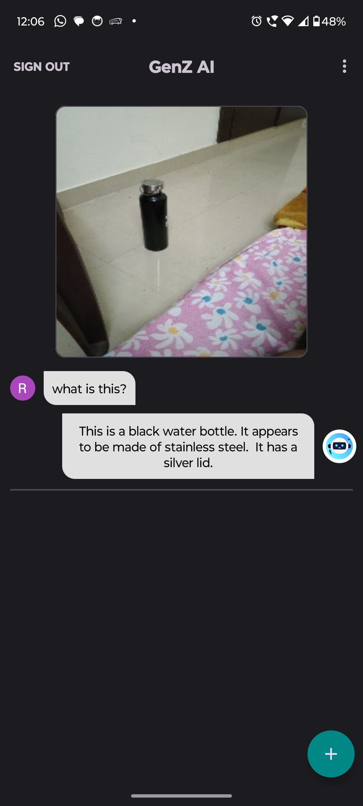

# GenzAI

# About
This Android application utilizes Google Gemini's cutting-edge AI capabilities to generate solutions based on user-provided text and image prompts. The app provides intelligent, context-aware responses and insights for a wide range of queries, offering an enhanced user experience powered by Google Gemini’s state-of-the-art AI models.

# Features

<b>1. Text and Image Prompt Solutions:</b> Generates insightful responses to user prompts, whether textual or visual.

<b>2. Google Gemini Integration:</b> Leverages the power of Google Gemini for high-quality, context-aware solutions.

<b>3. User-Friendly Interface:</b> Designed for ease of use with minimal setup required to start generating responses.

<b>4. Image Analysis:</b> Extracts relevant details from user-uploaded images and responds intelligently.

<b>5. Multimodal Capability:</b> Supports both text and image inputs for versatile use cases.

# Requirements

<b>1. Android Version:</b> Android 8.1 (Oreo) or higher

<b>2. API Level:</b> Minimum API Level 27

<b>3. Google Gemini Access:</b> Requires access to Google Gemini API and Google Cloud services (subscription may be required)

<b>4. Firebase:</b> For authentication and analytics

<b>5. Glide:</b> For image loading

# Tools Used
1. Android Studio IDE
2. MVVM Architecture
3. Hilt and Dagger
4. Room Database Library
5. Google Gemini SDK
6. Retrofit
7. Firebase Authentication
8. Glide

# Installation
You can install this application to test on your android smartphone. To download the signed application go to your chrome browser and copy-paste the download link:

https://github.com/Rahula-12/GenzAI/releases/download/GenZAI/GenzAI.apk

Download will be started automatically. After then install it on your android device. Open the application, download the youtube videos and enjoy! That's it.

N.B: It supports only in android version 8.1 or later.

# Preview

# Contribution
Contributions are welcome! If you'd like to contribute to this project, please follow these guidelines:

Fork the repository and create a new branch.
Make your changes and test them thoroughly.
Submit a pull request detailing the changes you've made.

# License
This project is licensed under the MIT License.
